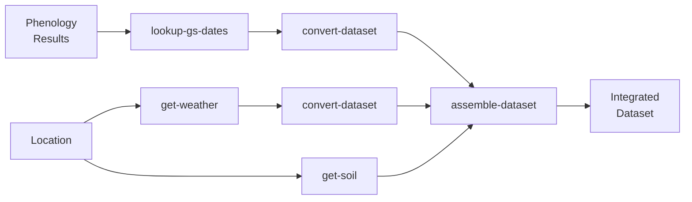

# csmTools - CWL Tools for Crop Simulation Modeling

## Overview
This directory contains Common Workflow Language (CWL) tools for integrating agricultural data for crop simulation modeling with DSSAT. The tools are based on the [csmTools R package](https://github.com/leroy-bml/uc6_csmTools) and provide standardized data acquisition, conversion, and integration capabilities.

## Available Tools

### 1. lookup-gs-dates.cwl
Extract specific growth stage dates from phenology analysis results.

**Purpose**: Converts detailed phenology time series into discrete growth stage dates needed for crop models.

**Inputs**:
- `phenology_results`: CSV file from phenology-analyzer
- `gs_scale`: Growth stage scale (zadoks, bbch)
- `gs_codes`: Comma-separated codes (e.g., "65,87")
- `date_select_rule`: Selection method (first, last, median)

**Output**:
- `phenology_json`: JSON file with growth stage dates

**Example**:
```bash
s4n execute local lookup-gs-dates.cwl \
  --phenology_results phenology_results.csv \
  --gs_scale zadoks \
  --gs_codes "65,87"
```

---

### 2. convert-dataset.cwl
Convert datasets between different model formats (user, ICASA, DSSAT).

**Purpose**: Standardize data from various sources into ICASA or DSSAT formats.

**Inputs**:
- `input_file`: JSON dataset to convert
- `input_model`: Source format (user, icasa, nasa-power, bonares)
- `output_model`: Target format (icasa, dssat)
- `output_filename`: Name for output file

**Output**:
- `converted_data`: Converted JSON dataset

**Example**:
```bash
s4n execute local convert-dataset.cwl \
  --input_file phenology.json \
  --input_model user \
  --output_model icasa \
  --output_filename phenology_icasa.json
```

---

### 3. get-weather.cwl
Download weather data from NASA POWER database.

**Purpose**: Acquire global daily weather data for crop modeling.

**Inputs**:
- `longitude`: Location longitude
- `latitude`: Location latitude
- `start_date`: Start date (YYYY-MM-DD)
- `end_date`: End date (YYYY-MM-DD)
- `output_filename`: Output file name

**Output**:
- `weather_data`: JSON file with weather time series

**Example**:
```bash
s4n execute local get-weather.cwl \
  --longitude 10.645269 \
  --latitude 49.20868 \
  --start_date 2024-01-01 \
  --end_date 2024-12-31
```

**Note**: Requires internet connection to access NASA POWER API.

---

### 4. get-soil.cwl
Extract soil profile data from SoilGrids database.

**Purpose**: Acquire standardized soil profile data for crop modeling.

**Inputs**:
- `longitude`: Location longitude
- `latitude`: Location latitude
- `output_filename`: Output file name

**Output**:
- `soil_data`: JSON file with multi-layer soil profile

**Example**:
```bash
s4n execute local get-soil.cwl \
  --longitude 10.645269 \
  --latitude 49.20868
```

**Note**: Requires internet connection to access SoilGrids API.

---

### 5. assemble-dataset.cwl
Assemble multiple dataset components into integrated dataset.

**Purpose**: Merge data from multiple sources (weather, soil, phenology, management).

**Inputs**:
- `component_files`: Array of JSON files to assemble
- `action`: Assembly method (merge_properties, append_rows, replace_section)
- `output_filename`: Output file name

**Output**:
- `assembled_data`: Integrated JSON dataset

**Example**:
```bash
s4n execute local assemble-dataset.cwl \
  --component_files weather.json soil.json phenology.json \
  --action merge_properties
```

---

## Data Format Standards

### ICASA Format
ICASA (International Consortium for Agricultural Systems Applications) is a standardized format for agricultural data exchange. It defines:
- Standard variable names and units
- Data structure for experiments, treatments, observations
- Metadata requirements

### DSSAT Format
DSSAT (Decision Support System for Agrotechnology Transfer) uses specific file formats:
- `.WTH`: Weather files
- `.SOL`: Soil files  
- `.WHX/.MZX`: Crop management files
- `.OUT`: Output files

The csmTools convert from ICASA → DSSAT for seamless integration.

## Workflow Integration

These tools are designed to work together in workflows:



## Docker Requirements

All tools use Docker containers with R and required packages:
- **Base image**: `rocker/r-ver:4.3`
- **Required packages**: csmTools, dplyr, readr, jsonlite

For production use, consider building a custom Docker image with csmTools pre-installed.

## Data Sources

### NASA POWER
- **URL**: https://power.larc.nasa.gov/
- **Coverage**: Global, 1981-present
- **Resolution**: 0.5° × 0.5° (≈50km)
- **Variables**: Temperature, precipitation, solar radiation, humidity, wind
- **Access**: Free, no API key required

### SoilGrids
- **URL**: https://soilgrids.org/
- **Coverage**: Global
- **Resolution**: 250m
- **Variables**: Soil texture, organic carbon, pH, bulk density, water content
- **Depth**: 7 standard depths (0-200cm)
- **Access**: Free via API

### FROST Server (for sensor data)
- **Protocol**: OGC SensorThings API
- **Coverage**: UC6 field sites
- **Variables**: Weather, soil moisture, NDVI from sensors
- **Access**: Requires authentication (see main README)

## Growth Stage Scales

### Zadoks Scale (Wheat)
| Code | Stage | Description |
|------|-------|-------------|
| 00-09 | Germination | Seed imbibition to emergence |
| 10-19 | Seedling | Leaf development |
| 20-29 | Tillering | Side shoot development |
| 30-39 | Stem elongation | Pseudo-stem formation |
| 40-49 | Booting | Flag leaf sheath extension |
| 50-59 | Ear emergence | Heading |
| 60-69 | Flowering | Anthesis |
| 70-79 | Milk development | Grain filling |
| 80-89 | Dough development | Grain maturation |
| 90-99 | Ripening | Senescence |

**Key stages for modeling**:
- **65**: Anthesis (50% of anthers visible)
- **87**: Physiological maturity (hard dough)

### BBCH Scale (Generic)
- **00-09**: Germination/sprouting
- **10-19**: Leaf development  
- **20-29**: Formation of side shoots
- **30-39**: Stem elongation
- **40-49**: Development of harvestable parts
- **50-59**: Inflorescence emergence
- **60-69**: Flowering
- **70-79**: Fruit development
- **80-89**: Ripening
- **90-99**: Senescence

## Error Handling

All tools include error handling for:
- Missing input files
- Invalid coordinates
- Network connectivity issues
- Data format mismatches

Check tool output and logs for specific error messages.

## Contributing

To add new tools to this directory:
1. Create CWL tool definition (`.cwl` file)
2. Include documentation in tool header
3. Follow naming convention: `action-subject.cwl`
4. Add example usage to this README
5. Test with sample data

## References

- [csmTools R Package](https://github.com/leroy-bml/uc6_csmTools)
- [DSSAT Documentation](https://dssat.net/)
- [ICASA Standards](http://research.agmip.org/display/dev/ICASA+Master+Variable+List)
- [NASA POWER Documentation](https://power.larc.nasa.gov/docs/)
- [SoilGrids API](https://rest.isric.org/soilgrids/v2.0/docs)
- [CWL User Guide](https://www.commonwl.org/user_guide/)
