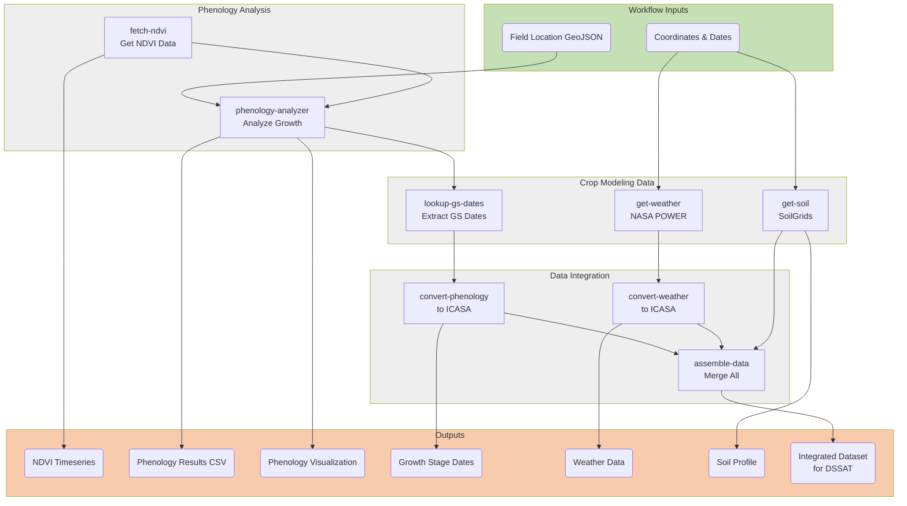

# CSM Workflow - Integrated Phenology and Crop Modeling

## Overview
This workflow extends the demo phenology workflow by integrating it with crop simulation modeling using DSSAT. It combines:
- **Remote sensing data**: NDVI time series from SensorThings API
- **Phenology analysis**: Growth stage estimation using weather-enhanced analysis
- **Crop modeling data**: Weather, soil, and phenology data formatted for DSSAT

## Workflow Steps

### Phase 1: Phenology Analysis (from demo workflow)
1. **fetch-ndvi**: Download NDVI time series from FROST server
2. **phenology-analyzer**: Analyze wheat phenology with weather integration

### Phase 2: Growth Stage Extraction
3. **lookup-gs-dates**: Extract specific growth stage dates (e.g., anthesis, maturity) from phenology results

### Phase 3: Data Acquisition
4. **get-weather**: Download weather data from NASA POWER database
5. **get-soil**: Extract soil profile from SoilGrids

### Phase 4: Data Integration
6. **convert-phenology**: Convert phenology data to ICASA format
7. **convert-weather**: Convert weather data to ICASA format
8. **assemble-data**: Integrate all data sources into unified dataset for DSSAT

## Workflow Diagram



## Usage

### Basic Execution
```bash
s4n execute local ./workflows/csmWorkflow/csm-workflow.cwl
```

### With Custom Parameters
Create an input file `csm-inputs.yml`:
```yaml
geojson:
  class: File
  path: data/field_location.geojson

longitude: 10.645269
latitude: 49.20868
start_date: "2024-01-01"
end_date: "2025-08-09"
gs_scale: "zadoks"
gs_codes: "65,87"  # Anthesis and maturity
```

Then execute:
```bash
s4n execute local ./workflows/csmWorkflow/csm-workflow.cwl csm-inputs.yml
```

## Outputs

### Phenology Outputs (from demo workflow)
- **ndvi_timeseries.csv**: Raw NDVI observations
- **phenology_results_csv**: Detailed daily predictions with weather data
- **phenology_results_png**: Visualization of growth stages

### Crop Modeling Outputs
- **growth_stage_dates** (JSON): Key growth stage dates in ICASA format
  - Anthesis date (Zadoks 65)
  - Maturity date (Zadoks 87)
  
- **weather_data** (JSON): Weather time series in ICASA format
  - Daily temperature, precipitation, solar radiation
  
- **soil_data** (JSON): Soil profile data
  - Multi-layer soil properties from SoilGrids
  
- **integrated_dataset** (JSON): Complete dataset ready for DSSAT
  - All data sources merged and formatted for crop simulation

## Growth Stage Codes

### Zadoks Scale (Wheat)
- **10**: First leaf emergence
- **30**: Stem elongation
- **50**: Ear emergence
- **65**: Anthesis (flowering)
- **87**: Physiological maturity

### BBCH Scale (Generic)
- **60**: Beginning of flowering
- **89**: Full maturity

## Data Sources

### Remote Sensing
- **FROST Server**: SensorThings API for NDVI data
- **Open-Meteo**: Weather data for phenology analysis

### Crop Modeling
- **NASA POWER**: Global weather database
- **SoilGrids**: Global soil information system
- **Phenology Analysis**: Growth stage dates from remote sensing

## Requirements

### R Packages (in Docker container)
- csmTools: Data integration for crop modeling
- dplyr, readr: Data manipulation
- jsonlite: JSON I/O

### Environment Variables (for FROST access)
```bash
export FROST_CLIENT_ID="your_client_id"
export FROST_CLIENT_SECRET="your_secret"
export FROST_USERNAME="your_username"
export FROST_PASSWORD="your_password"
export FROST_USER_URL="https://your-frost-server.com"
```

## Next Steps

After running this workflow, the integrated dataset can be:
1. Used directly for DSSAT simulation (requires DSSAT installation)
2. Further calibrated with field observations
3. Used for scenario analysis (different management practices, climate scenarios)

## Notes

- The workflow requires network access for downloading weather and soil data
- DSSAT simulation step is not included (requires local DSSAT installation)
- Phenology dates are estimated from remote sensing and may need validation
- Soil data from SoilGrids are global estimates and may benefit from local calibration

## References

- [csmTools R Package](https://github.com/leroy-bml/uc6_csmTools)
- [DSSAT Crop System Model](https://dssat.net/)
- [NASA POWER](https://power.larc.nasa.gov/)
- [SoilGrids](https://soilgrids.org/)
- [Zadoks Growth Stage Scale](https://www.bayer.com/sites/default/files/2020-11/zadoks-growth-stages-identification-guide.pdf)
